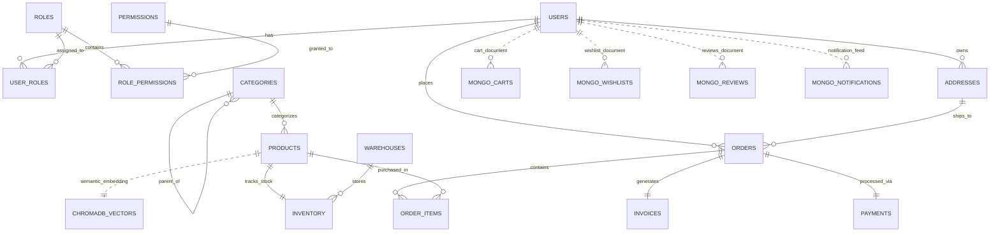

# Entity Relationship Diagram (ERD)

The following Mermaid diagram outlines the complete multi-database domain architecture for the Amazon Backend System, encompassing Relational SQL storage, Document MongoDB collections, and Vector ChromaDB stores.

## Storage Engine Mapping

| Entity | Primary Storage System | Responsibilities |
|---|---|---|
| **Users / Roles / Auth** | SQLite / PostgreSQL (SQL) | Identity, Credentials, RBAC, Claims |
| **Products & Catalog** | SQLite / PostgreSQL (SQL) | SKU, Pricing, Branding, Discounts |
| **Inventory & Warehouse**| SQLite / PostgreSQL (SQL) | Stock Levels, Reserved Stock, Warehouses |
| **Orders & Payments** | SQLite / PostgreSQL (SQL) | Transactions, Line Items, Addresses |
| **PDF Invoices & Receipts**| Filesystem (`/uploads/invoice`) | Generated ReportLab PDF Documents |
| **Shopping Cart** | MongoDB | Dynamic user cart state & temporary items |
| **Wishlist & Notifications**| MongoDB | Saved items & async alert feeds |
| **Semantic Search / Vector**| ChromaDB | Vector embeddings, recommendations & similarity |
